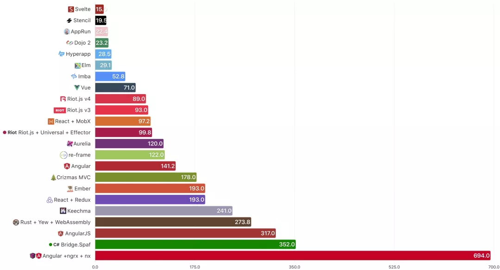
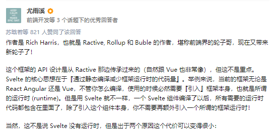
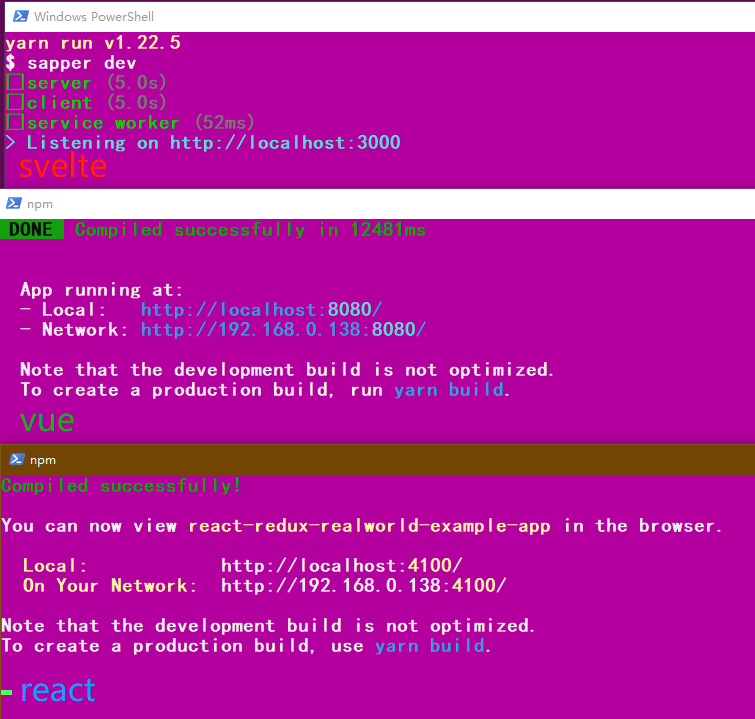
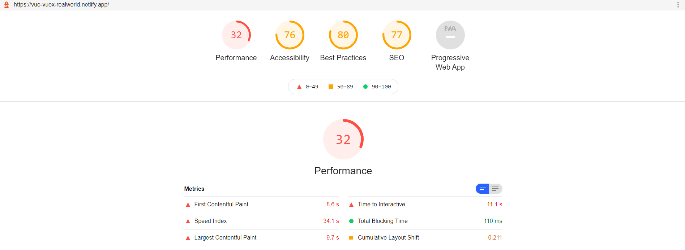
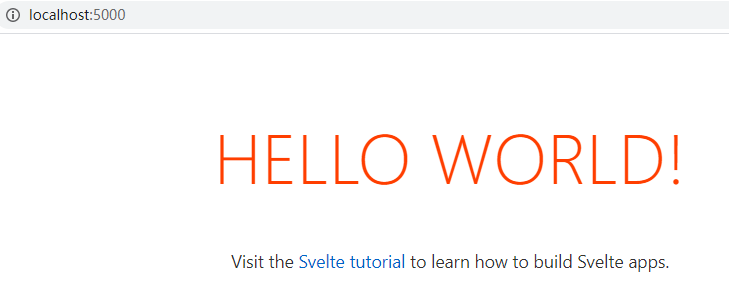
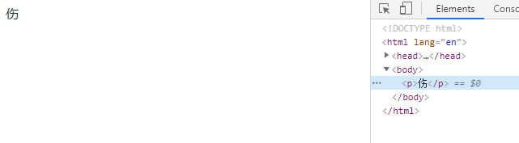
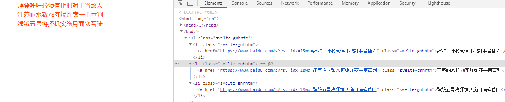
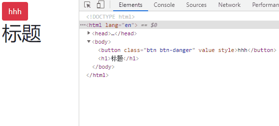
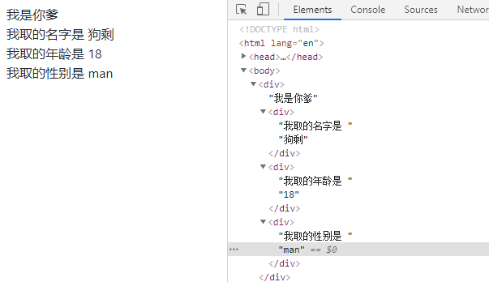
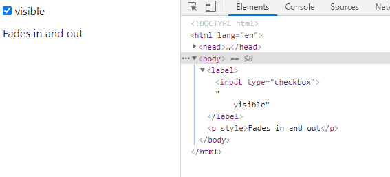

### 说在前面

`svelte` 不知道大家有没有了解过，最近一次偶然刷文章，看到一篇[《都快2020年，你还没听说过SvelteJS?》](https://zhuanlan.zhihu.com/p/97825481) [0] 的文章，看了svelte与其他框架的对比

[svelte 中文 doc](https://www.firecat.run/) [1]

对比各框架开发的项目的尺寸




对比各项目的 Lighthouse 性能评分


说实话属实有点惊讶到我。 ** 真的假的？

于是我抱着试试就试试的心态来做个评测人


### 关于虚拟DOM

svelte 的作者 Rich Harris 在一篇名为[《虚拟DOM纯粹是开销》](https://svelte.dev/blog/virtual-dom-is-pure-overhead) [2] 的文章中指出，为什么不使用虚拟dom

虚拟dom的三个步骤

1. 两个快照都包含一个元素。在两种情况下都是`<div>`，这意味着我们可以保留相同的DOM节点
2. 我们列举了新旧属性上的所有属性，`<div>`以查看是否需要更改，添加或删除任何属性。在这两种情况下，我们都有一个属性-a`className`的值为`"greeting"`
3. 下降到元素中，我们看到文本已更改，因此我们需要更新真实的DOM

而 svelte 直接跳过前面两步，直接执行第三步


```javascript
if (changed.name) {
  text.data = name;
}
```

这几乎就是Svelte生成的更新代码。与传统的UI框架不同，Svelte是一种编译器，它在*构建时*就知道应用程序中的*情况*如何变化，而不必等着在*运行时*进行工作。


### 业内大牛如何看待 svelte

vue 的作者尤雨溪，在知乎回答了个 [《如何看待 svelte 这个前端框架？》](https://www.zhihu.com/question/53150351) [3] 问题



“svelte 的核心思想在于 **通过静态编译来减少框架运行时的代码**”


### 关于 UI

我觉着这两个ui还是比较不错的

**Material UI**

https://sveltematerialui.com/

https://github.com/hperrin/svelte-material-ui


**SVELTESTRAP**

https://sveltestrap.js.org/

https://github.com/bestguy/sveltestrap


### svelte 与其他框架

老严闲来的时候找到了 一个叫做 `Realworld` 存储库中有24种conduit实现As ，也就是用来对比性能的以及大小的；

今天一起来对比一下 vue/react/svelte 这三个框架的 

- 项目打包后压缩包大小
- 项目网页性能分析对比


vue：https://github.com/gothinkster/vue-realworld-example-app

react：https://github.com/gothinkster/react-redux-realworld-example-app

svelte：https://github.com/sveltejs/realworld

感兴趣的同学也可以看看其他框架 https://github.com/gothinkster/realworld



#### 开始打包

这三个项目，打包顺序基本上在同一时间执行 `npm run build`，svelte 直接在我我眨眼的一瞬间打完包 ，啪 很快啊 （有点夸张~几秒钟）

静静的等待vue和react同时打包完之后，我开始进行统一压缩静态文件，压缩格式为zip


#### 对比大小

排名如下

1. svelte   —  89.9 KB
2. vue       —  483 KB
3. react     —  490 KB

果然差距还是确实如传说一样恐怖


#### 性能考核

严老湿本次使用 Chrome 的 Lighthouse （谷歌网页性能分析工具） 来对比性能评分 

全局安装 `lighthouse`

```shell
npm install -g lighthouse
```

执行 （直接使用的对应的线上地址）

```shell
lighthouse https://realworld.svelte.dev/
```

这是我在下面所测试的截屏

vue 



react


svelte


#### 对比性能

性能得分排名如下：

1. svelte   —  83
2. react    —  52
3. vue      —  32

`svelte` 也是不负众望 稳居第一


### 使用 svelte 模板

看到上面，天天被逼着做性能优化的同学，激动起来了 ~ 那我们一起来简单学习一下这个性能强悍的 svelte 吧

svelte 模板 [4] ，我们直接使用一个模板来开工

```shell
git clone https://github.com/sveltejs/template
&
cd template-master
```


### 下载依赖

```shell
yarn install 
or 
npm install
```

下载完成之后，我们看看目录。老严的评价就是 `简洁`


### 启动项目

```shell
yarn dev
or
npm run dev
```

启动完成之后

```shell
  Your application is ready~! �

  - Local:      http://localhost:5000
  - Network:    Add `--host` to expose
```


### 打开页面

地址栏输入 `http://localhost:5000`



我们可以看到这样的一个页面 hello world

### 安装ui

这里我们使用 sveltestrap

```javascript
npm install --save sveltestrap 
npm install --save bootstrap
```

在 main.js 中引入

```javascript
import 'bootstrap/dist/css/bootstrap.min.css';
```

在页面中引入组件

```js
<script>
	import { Button } from "sveltestrap";
	const handleClick = () => alert("I warned you!");
</script>

<Button color="danger" on:click={handleClick}>Do Not Press</Button>
```


### 简单了解语法

在学习之前我觉得有必要简单了解一下其语法

#### 绑定数据

在 vue 中我们的变量需要写在 `data` 中 ，而 `svelte` 语法更加贴合原生

``` html
<!-- vue -->
data() {
	return {
		name: 'hhh',
	};
}

<div>{{name}}</div>
```


svelte 绑定数据 ，svelte 动态绑定需要加上 {}

```html
<script>
	import { Button } from "sveltestrap";
	// 定义数据
	let name = "hhh";
	let src = 'http://crazy-x-lovemysoul-x-vip.img.abc188.com/images/logo.png';
</script>
<!-- 绑定数据 -->
<!-- 如果kv一致只用写一个 -->

<Button>{name}</Button>
```


#### 条件渲染

vue 中有条件渲染 `v-if`  `v-else-if` `v-else` ,svelte 也有

```html
<script>
	let condition = 1;
</script>
{#if condition == 2}
	<p>悲</p>
{:else if condition == 1}
	<p>伤 </p>
{:else if condition == 0}
	<p>日</p>
{:else}
	<p>记</p>
{/if}
```



#### 循环渲染

循环渲染列表

```html
<script>
    // 定义变量
	let news = [
        { id: 1, title: '拜登呼吁必须停止把对手当敌人' },
        { id: 2, title: '江苏响水致78死爆炸案一审宣判' },
        { id: 3, title: '嫦娥五号将择机实施月面软着陆' }
    ];
</script>


<ul>
    <!-- 有没有点 ejs的感觉 -->
	{#each news as {title}}
		<li>
			<a href="https://www.baidu.com/s?rsv_idx=1&wd={title}">
				{title}
			</a>
		</li>
	{/each}
</ul>


<style>
	ul,li{
		list-style: none;
	}
	a{
		color: #ff3e00;
	}
</style>
```



咋感觉有点像 `ejs` 循环渲染呢  [5]呢?


#### 事件绑定

在 `svelte` 中方法直接写函数定义函数即可使用

```html
<script>
	import { Button } from "sveltestrap";
	// 定义数据
	let name = "hhh",title = '标题';
	// 定义方法
	const handleClick = () => {
		name = "严老湿"
		title = "老严带你入坑 svelte"
	};
</script>
<!-- on:click 绑定方法  {绑定动态值}-->
<Button color="danger" on:click={handleClick}>{name}</Button>
<h1>{title}</h1>
```




#### 组件

组件是框架必不可少的一个功能

来看看 svelte 中如何创建一个组件吧

app.svelte 

```html
<script>
    // 直接引入组件即可使用 无需注册
	import Child from './components/child.svelte'
	let name = '我是你爹'
</script>

<div>
	{name}
	<Child></Child>
</div>
```

创建一个 child.svelte 页面

```html
<script>
    let title = '我是你儿子'
</script>

<div>{title}</div>
```


那么组件有了，我们来看看组件传值吧！

##### 传值

app.svelte 

```html
<script>
	import Child from './components/child.svelte'
	let name = '我是你爹'
	let childName = "狗剩"
</script>

<div>
	{name}
	<Child {childName}></Child>
</div>
```


child.svelte 

```html
<script>
    export let childName;
</script>

<div>爹给我取的名字是 {childName}</div>
```


刚刚我们是简单的单一传值

接下来我们传一个对象试试

app.svelte 

```html
<script>
	import Child from './components/child.svelte'
	let name = '我是你爹'
	let aboutMe = {
		name:'狗剩',
		age:18,
		gender:'man'
	}
</script>

<div>
	{name}
    <!-- 通过... 展开 aboutMe -->
	<Child {...aboutMe}></Child>
</div>
```

child.svelte 

``` html
<script>
    export let name,gender,age;
</script>

<div>我取的名字是 {name}</div>
<div>我取的年龄是 {age}</div>
<div>我取的性别是 {gender}</div>
```



那这多费劲呐？还需要一个个接收。有一话叫存在即合理


#### 动画

在官方 api 中提到 svelte 提供了一些动画效果出来给大家使用


我们直接使用官方示例 淡入淡出动画

```html
<script>
	import { fade } from 'svelte/transition';
	let visible = true;
</script>

<label>
	<input type="checkbox" bind:checked={visible}>
	visible
</label>

{#if visible}
	<p transition:fade>
		Fades in and out
	</p>
{/if}
```



#### 生命周期

在 svelte 中的生命周期有onMount 、beforeUpdate 、afterUpdate 、afterUpdate 下面老严依次给大家伙列出来

- onMount （挂载后）

  该`onMount`函数作为将component挂载到DOM后立即执行的回调。它必须在component初始化期间被调用（但不必位于component内部；可以从外部模块调用它）。

  ```html
  <script>
      import { onMount } from 'svelte';
  
      onMount(() => {
          console.log('the component has mounted');
      });
  </script>
  ```

  如果需要`onMount`返回一个函数，则在卸载 component 时调用该函数。

  ```html
  <script>
  	import { onMount } from 'svelte';
  
  	onMount(() => {
  		const interval = setInterval(() => {
  			console.log('beep');
  		}, 1000);
  
  		return () => clearInterval(interval);
  	});
  </script>
  ```

  

- beforeUpdate （更新前）

  `beforeUpdate`任何状态更改后组件更新之前，回调函数会立即运行。第一次回调运行将在初始onMount之前.

  ```html
  <script>
      import { beforeUpdate } from 'svelte';
  
      beforeUpdate(() => {
          console.log('the component is about to update');
      });
  </script>
  ```


- afterUpdate （更新后)

  `afterUpdate`在组件更新后立即运行回调

  ```html
  <script>
      import { afterUpdate } from 'svelte';
  
      afterUpdate(() => {
          console.log('the component just updated');
      });
  </script>
  ```


- onDestroy（销毁后）

  在组件卸载后运行回调。在onMount、beforeUpdate、afterUpdate和onDestroy中，这是唯一一个在服务器端组件中运行的组件。

  ```html
  <script>
      import { onDestroy } from 'svelte';
  
      onDestroy(() => {
          console.log('the component is being destroyed');
      });
  </script>
  ```


### 案例

老严逛着逛着 正好看到一个 官方示例的 `to do list` 本来还想着说带大家做，那既然有现成的，将就一下

没有什么框架是写一个 todolist 还学不会的 ，老严在代码里面也加了一些代码注释

因为样式代码 太多,我们先上效果图再看代码


```html
<script>
	import { quintOut } from 'svelte/easing';
	import { crossfade } from 'svelte/transition';
	import { flip } from 'svelte/animate';
	// 动画
	const [send, receive] = crossfade({
		duration: d => Math.sqrt(d * 200),

		fallback(node, params) {
			const style = getComputedStyle(node);
			const transform = style.transform === 'none' ? '' : style.transform;
			return {
				duration: 600,
				easing: quintOut,
				css: t => `
					transform: ${transform} scale(${t});
					opacity: ${t}
				`
			};
		}
	});

	let uid = 1;
	// 默认数据
	let todos = [
		{ id: uid++, done: false, description: 'write some docs' },
		{ id: uid++, done: false, description: 'start writing blog post' },
		{ id: uid++, done: true,  description: 'buy some milk' },
		{ id: uid++, done: false, description: 'mow the lawn' },
		{ id: uid++, done: false, description: 'feed the turtle' },
		{ id: uid++, done: false, description: 'fix some bugs' },
	];
	// 新增待办
	function add(input) {
		const todo = {
			id: uid++,
			done: false,
			description: input.value
		};

		todos = [todo, ...todos];
		input.value = '';
	}
	// 删除方法
	function remove(todo) {
		todos = todos.filter(t => t !== todo);
	}
	// 选中方法
	function mark(todo, done) {
		todo.done = done;
		remove(todo);
		todos = todos.concat(todo);
	}
</script>

<div class='board'>
    <!-- 点击回车执行add  -->
	<input
		placeholder="what needs to be done?"
		on:keydown={e => e.which === 13 && add(e.target)}
	>
	<!-- 代办 -->
	<div class='left'>
		<h2>todo</h2>
		{#each todos.filter(t => !t.done) as todo (todo.id)}
			<label
				in:receive="{{key: todo.id}}"
				out:send="{{key: todo.id}}"
				animate:flip
			>
				<!-- 选中代表已做完 -->
				<input type=checkbox on:change={() => mark(todo, true)}>
				{todo.description}
				<!-- 删除 -->
				<button on:click="{() => remove(todo)}">remove</button>
			</label>
		{/each}
	</div>
	<!-- 已完成 -->
	<div class='right'>
		<h2>done</h2>
		{#each todos.filter(t => t.done) as todo (todo.id)}
			<label
				class="done"
				in:receive="{{key: todo.id}}"
				out:send="{{key: todo.id}}"
				animate:flip
			>
				<!-- 修改状态为代办 -->
				<input type=checkbox checked on:change={() => mark(todo, false)}>
				{todo.description}
				<!-- 删除 -->
				<button on:click="{() => remove(todo)}">remove</button>
			</label>
		{/each}
	</div>
</div>

<style>
	.board {
		display: grid;
		grid-template-columns: 1fr 1fr;
		grid-gap: 1em;
		max-width: 36em;
		margin: 0 auto;
	}

	.board > input {
		font-size: 1.4em;
		grid-column: 1/3;
	}

	h2 {
		font-size: 2em;
		font-weight: 200;
		user-select: none;
		margin: 0 0 0.5em 0;
	}

	label {
		position: relative;
		line-height: 1.2;
		padding: 0.5em 2.5em 0.5em 2em;
		margin: 0 0 0.5em 0;
		border-radius: 2px;
		user-select: none;
		border: 1px solid hsl(240, 8%, 70%);
		background-color:hsl(240, 8%, 93%);
		color: #333;
	}

	input[type="checkbox"] {
		position: absolute;
		left: 0.5em;
		top: 0.6em;
		margin: 0;
	}

	.done {
		border: 1px solid hsl(240, 8%, 90%);
		background-color:hsl(240, 8%, 98%);
	}

	button {
		position: absolute;
		top: 0;
		right: 0.2em;
		width: 2em;
		height: 100%;
		background: no-repeat 50% 50% url("data:image/svg+xml,%3Csvg xmlns='http://www.w3.org/2000/svg' viewBox='0 0 24 24'%3E%3Cpath fill='%23676778' d='M12,2C17.53,2 22,6.47 22,12C22,17.53 17.53,22 12,22C6.47,22 2,17.53 2,12C2,6.47 6.47,2 12,2M17,7H14.5L13.5,6H10.5L9.5,7H7V9H17V7M9,18H15A1,1 0 0,0 16,17V10H8V17A1,1 0 0,0 9,18Z'%3E%3C/path%3E%3C/svg%3E");
		background-size: 1.4em 1.4em;
		border: none;
		opacity: 0;
		transition: opacity 0.2s;
		text-indent: -9999px;
		cursor: pointer;
	}

	label:hover button {
		opacity: 1;
	}
</style>
```


当你可以手动写出这个todolist的时候，你就已经出师了，因为老严也就这点能耐 哈哈

最后代码，我提交到了git 有需要的同学可以去下载噢

### 注解

[0] https://zhuanlan.zhihu.com/p/97825481

[1] https://www.firecat.run/

[2] https://svelte.dev/blog/virtual-dom-is-pure-overhead

[3] https://www.zhihu.com/question/53150351

[4] https://github.com/sveltejs/template

[5] https://ejs.bootcss.com/#docs


### 参考文献

- https://www.firecat.run/docs
- https://zhuanlan.zhihu.com/p/97825481
- https://iiong.com/sveltejs-study-notes/

<Comment/>