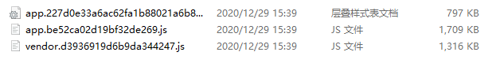
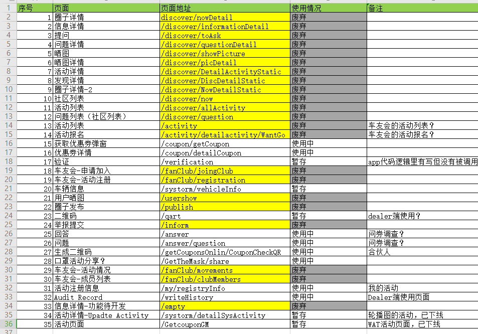
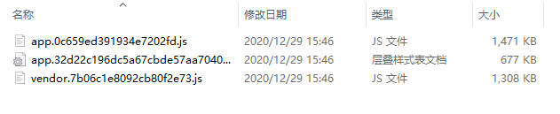
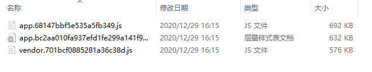

## 目录
- 前言
- 为什么要优化
- 从哪里开始下手
- 现在开始
  - 1.代码压缩
  - 2.删除一些废弃的页面
  - 3.使用 cdn 优化
  - 4.修改路由引入方式
- 结果


## 前言

> “这页面加载也太慢了！”，一个宁静的下午就此打破，在老板和 PM 的 `威逼利诱之下` ，我开始了对这个祖传(shi)山项目进行了优化，因为这个项目传到我手上至少经过了4-5代前端了，很多东西也不敢随意删，找不到负责人。


## 为什么要优化？

我们主要看首屏加载速度，在测试环境我们项目其实跑得还是蛮快，但是生产环境是用印尼比较差的服务器，再加上需要 kexue 上网（总是网络出现波动），在这次 UI 2.0 上线之后，堆积的东西终于越来越多，项目也越来越庞大。毫不夸张的说我们现在使用 `4G` 首次打开页面的速度大概在 16 秒以上，根据下面的表格推断出客户流失率，可是在印尼还在用着 `3G` 网络，可想而知这流失率太恐怖了。并且这是一个 C 端产品，所以要更加考虑用户体验了

**客户等待页面时长的流失率**


作为一个开发者，你对首页打开速度又有多高的要求呢？


## 从哪里开始下手

在观察了这个项目架构之后呢，我推断出以下几个可行方案

1. 对于代码打包进行压缩
2.  废除以前不该用到的组件及页面
3. 使用 CDN 引入部分资源
4. 优化路由，修改引入方式


对于这几个优化方案，也是试了一遍又一遍。确实是效果挺大的才发出来给大家围观一下


## 现在开始

记住这张图中三个比较大的文件 size, 我们每进行一步方案就看看效果


### 1.代码压缩

代码压缩是一个很不错选择，我们首先需要下载一些依赖

**css 代码压缩 (optimize-css-assets-webpack-plugin)**

下载

```shell
npm install optimize-css-assets-webpack-plugin
```

webpack.config.js 使用

```js
const OptimizeCSSPlugin = require('optimize-css-assets-webpack-plugin');
plugins: [
    new OptimizeCSSPlugin()
]
```


**js 代码压缩 (uglifyjs-webpack-plugin)**

下载

```shell
npm install optimize-css-assets-webpack-plugin
```

webpack.config.js 使用

```js
const UglifyJsPlugin = require('uglifyjs-webpack-plugin')
plugins:[
      new UglifyJsPlugin({
      cache: true,   // 开启缓存
      parallel: true, // 开启多线程编译
      sourceMap: true,  // 是否sourceMap
      uglifyOptions: {  // 丑化参数
        comments: false,
        warnings: false,
        compress: {
          unused: true,
          dead_code: true,
          collapse_vars: true,
          reduce_vars: true
        },
        output: {
          comments: false
        }
      }
    }),
]
```


**开启gzip**

安装

```shell
npm install compression-webpack-plugin
```

webpack.config.js 使用

```js
const CompressionWebpackPlugin = require('compression-webpack-plugin')
plugins:[
    new CompressionWebpackPlugin({
      asset: '[path].gz[query]',
      algorithm: 'gzip',
      test: new RegExp(
        '\\.(' +
        ['js', 'css'].join('|') +
        ')$'
      ),
      threshold: 10240,
      minRatio: 0.8
	})
]
```

nginx 配置

```nginx
gzip on;
gzip_static on;
gzip_min_length 1k;
gzip_buffers 4 32k;
gzip_http_version 1.1;
gzip_comp_level 2;
gzip_types text/plain application/x-javascript text/css application/xml;
gzip_vary on;
gzip_disable "MSIE [1-6].";
```


先看看效果




我们在第一步就差不多减少了 1/2 的大小


接着往下看


### 2.删除一些废弃的页面

这个项目因为之前是一直迭代过来的，在前面也有讲到，但是我还是下定决心删除它们，在截取了一系列屏之后，我找到了老员工 与 PM 来确认页面是否已经废弃，这个环境比较费时间，这下面的表格就是一个个确认出来的



在删除这些路由之后我重新进行了打包，请看下面，还是有点效果的嘛，但这并没有达到我的预期效果



### 3. 使用cdn开始性能优化

我们当前使用了 mint ui 库，vue 全家桶 一系列玩意，我们找到对应的 `cdn` 在index.html中引入

```html
<script src="https://cdn.bootcdn.net/ajax/libs/vue/3.0.2/vue.cjs.js"></script>
<script src="https://cdn.bootcdn.net/ajax/libs/mint-ui/2.2.9/actionsheet/index.js"></script>
<script src="https://cdn.bootcdn.net/ajax/libs/axios/0.21.0/axios.js"></script>
<script src="https://cdn.bootcdn.net/ajax/libs/vue-router/3.4.8/vue-router.common.js"></script>
<script src="https://cdn.bootcdn.net/ajax/libs/vue-i18n/8.22.1/vue-i18n.common.js"></script>
```


引入完之后呢？将不需要打包的资源进行相应的配置，所以我们需要在 webpack.config.js 中写上

```js
externals:{
    'vue':'Vue',
    'mint-ui':'MINT',
    'axios':'axios',
    'vue-router':'VueRouter',
    'vue-i18n':'VueI18n',
},
```

这样就可以用来忽略这些资源了


### 4.修改路由引入方式

老严将页面的组件（去除之前删除的页面）数了一下是 73个，一般使用 `import` 引入的写法，当项目打包时路由里的所有 `component` 都会打包在一个js中，在项目刚进入首页的时候，就会加载所有的组件，所以导致首页加载较慢

`import ` 引入

```js
import DetailActivityStatic from '@/components/discover/share/DetailActivityStatic'

export default [
    {
    	path: "/discover/DetailActivityStatic",
    	component: DetailActivityStatic
	}
]
```

现在老严全部改为 使用 `require` 

```js
export default [
    {
        path: "/discover/DetailActivityStatic",
        component: resolve => require(['@/components/discover/share/DetailActivityStatic'], resolve)
    }
]
```

这个环节也有点累，因为页面实在太多了，下面是打包后的效果



我们惊奇的发现 js确实小了挺多，那么这些这些内容去哪了？我们也没有删除啊


在js文件夹中，我们发现了好多个单个js，这是为什么呢？

因为用 `require` 会将 `component` 分别打包成不同的js，按需加载，访问此路由时才会加载这个js，所以就避免进入首页时加载内容过多。


所噶，到此为止我们优化做完了。我们来看看效果吧!


## 结果

来看看效果吧！


有些仔细的朋友会发现，这个app.js 与 vendor.js 怎么会变得比刚刚还小呢？

因为我们得第一步压缩代码里面做了 gzip 压缩


现在首屏打开基本上控制在 1-3s 左右浮动了

相比之前的 16s 简直不要强太多，PM 与 老板 直呼 “这也太快了！啊啊啊~”


<Comment/>