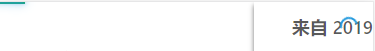
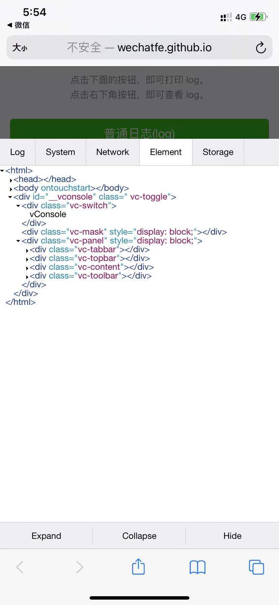
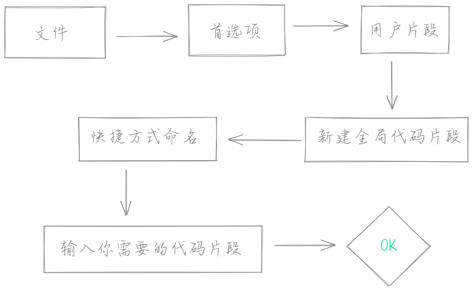
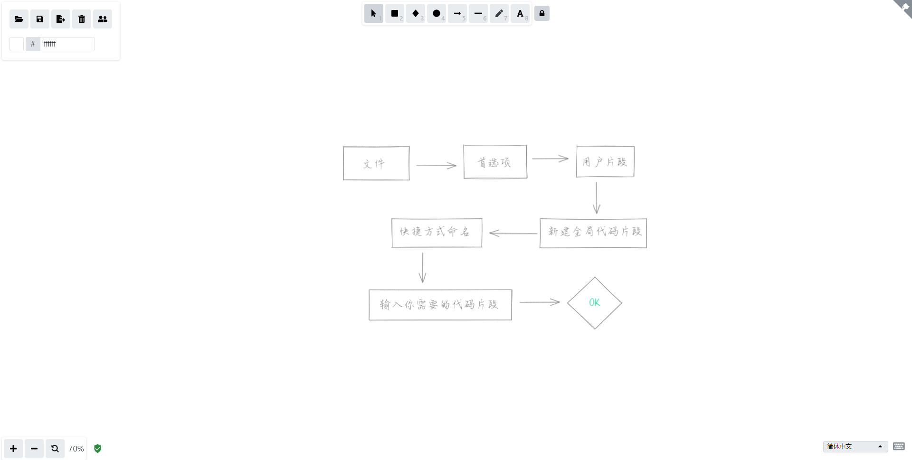

### 目录结构

- 轮子篇
  - browser
  - mindmap
  - nprogress
  - vConsole
- VScode 篇
  - DIY 代码片段
  - Image Preview
- 工具篇
  - markdown-nice
  - excalidraw
  - GitHub Readme Stats
  - gh-pages


### 轮子篇

####  1.browser

Star `731`

在这个打死不做兼容的前端时代，我们开发者会用谷歌浏览器，但是有些用户没有安装 `Chrome` 浏览器，或者是装了其他各式各样的杂牌浏览器内核可能是用的 `Chrome `  但是有些渲染机制却千姿百态，比如 `Edge` `360 ` 等等浏览器都是，所以单单使用判断内核是没用的，所以我们需要判断是否为原生谷歌浏览器。为了提倡 `有轮子便用，绝不重复造轮子` 的宗旨，所以老严找到了 `browser`

地址： https://github.com/mumuy/browser

简单使用

引入

```html
<script src="./Browser.js"></script>
```

使用

```js
const info = new Browser
if(info.browser === "Chrome"){
  ...
}
```


#### 2.mindmap

Star `223`

我们想象力永远比不过 `产品经理` 、`甲方`、和`老板` ，突然有一天甲方说，让你在项目中加一个可编辑的思维导图，然后保存成笔记。当时听到这个需求时，我正在练习闪电五连鞭。还好老严在 轮子市场 找到了它  —`mindmap`


简单使用

下载

```shell
npm install @hellowuxin/mindmap
```

使用

```html
<template>
  <mindmap v-model="data"></mindmap>
</template>

<script>
import mindmap from '@hellowuxin/mindmap'

export default {
  components: { mindmap },
  data(){
    return{
      data: [{
      name:"如何学习D3",
      children: [
        {
          name:"预备知识",
          children: [
            { name:"HTML & CSS" },
            { name:"JavaScript" },
          ]
        },
        {
          name:"安装",
          _children: [
            { name: "折叠节点" }
          ]
        },
        {
          name:"进阶",
          left: true
        },
      ]
    }]
    }
  }
}
</script>
```

地址：https://github.com/hellowuxin/mindmap


#### 3.nprogress

Star `22.1k`

提高用户体验的一大神器，页面进度条加载，在页面跳转时使用 `NProgress ` 它会在顶部出现一个进度条，支持自定义配置颜色大小



简单使用

安装

```shell
npm install NProgress
```

main.js

```js
import NProgress from 'nprogress';

router.beforeEach((to, from, next) => {
  NProgress.start();
  next()
});

router.afterEach(transition => {
  NProgress.done();
});
```

地址：https://github.com/rstacruz/nprogress


#### 4.vConsole

Star `12.4k`

移动端调试，是一个非常棘手的事情，你永远不知到真机到底会发生什么意外，你还在使用 alert 来调试移动端吗？但是如果你有了 `vConsole` ，这一切将会变得轻而易举

<span></span>

查看元素查看`Log` 、`System`、 `Network` 、`Element` 、`Storage` 就是这么简单

简单使用

```html
<script src="vconsole.min.js"></script>
<script>
  // 初始化
  var vConsole = new VConsole();
  console.log('Hello world');
</script>
```

https://github.com/Tencent/vConsole


### VScode 篇

#### 1.DIY 代码片段

平常我们都会用到一些模板工具 来便捷生成 代码片段



我的代码片段

你需要修改 `prefix` 名称

```json
{
    "Print to console": {
        "prefix": "yjh",
        "body": [
            "<!-- $1 -->",
            "<template>",
            "<div class='$2'>$5</div>",
            "</template>",
            "",
            "<script>",
            "export default {",
            "components: {},",
            "data() {",
            "return {",
            "",
            "};",
            "},",
            "computed: {},",
            "watch: {},",
            "methods: {",
            "",
            "},",
            "created() {",
            "",
            "},",
            "mounted() {",
            "",
            "},",
            "beforeCreate() {}, ",
            "beforeMount() {}, ",
            "beforeUpdate() {},",
            "updated() {}, ",
            "beforeDestroy() {}, ",
            "destroyed() {}, ",
            "activated() {}, ",
            "}",
            "</script>",
            "<style lang='scss' scoped>",
            "//@import url($3); 引入公共css类",
            "$4",
            "</style>"
        ],
        "description": "Log output to console"
    }
}

```

保存之后你就可以在使用模板快捷名来生成模板了


#### 2.Image Preview

有时候在我们的屎山代码中想要找到一张图片是一件很不容易的事情

我们可以使用 `Image Preview` 插件

它会在行号左侧的小槽中展示图片的预览，MD 中也可以 hover 预览


### 工具篇

####  1.markdown-nice

Star `2.7k`

号主必备工具 ， 当你看到这篇文章的时候我就是采用的 `markdown-nice` 有人问我它的优点在哪？哼

1. 支持markdown语法
2. 海量主题任你选择
3. 导入导出文件很方便
4. 16关教程教你快速上手
5. DIY 主题，定制自己的样式
6. 实时保存，不再担心忘记Ctrl+S
7. html 源码直接转 markdown 
8. 支持在线编辑，无需安装编辑器

地址：https://github.com/mdnice/markdown-nice


#### 2.excalidraw

Star `13.7k`

一款手绘风格的画图工具（神绘），因为发文章和做笔记的时候经常需要画图，比如一个项目构建流程、源码功能实现流程需要画一个图，有些流程图去用官方的又太过官方，所以选择一个自己喜欢的画图工具也是不错的，至少比电脑自带的 `画图` 工具要强

地址：https://github.com/excalidraw/excalidraw




#### 3.GitHub Readme Stats

Star `15.8k`

想要将自己的 GitHub 打造得更炫酷一点？比如做一个小卡片咋样放到个人主页咋样

简单操作

1.创建一个项目跟自己用户名一样

2.创建一个 README.md 文件 下面的是示例，大家可以对照着图片来修改

```shell
[](https://github.com/CrazyMrYan)
```


效果图：


地址：https://github.com/anuraghazra/github-readme-stats


#### 4.gh-pages

我们可能经常写一些笔记或者自己的个人网站，但是需要部署静态文件，但是这需要`域名`、`服务器`、`备案` 等等一些列操作，老严怎么会去花钱？有白嫖的必须安排上。相信大家经常也会看到别人的博客都是直接使用的 `https://用户名.github.io/项目名` 

简单操作

1.`clone` 项目到本地

```shell
git clone git@github.com:CrazyMrYan/home.git
```

2.安装依赖

```shell
npm install  
or  
yarn install
```

3.打包

```shell
npm run build 
or 
yarn build 
```

4.打完包之后，我们需要进入到打包后的静态文件夹中进行初始化

```shell
cd dist
&
git init
```

5.创建分支

```shell
git checkout --orphan gh-pages
```

6.将文件放到暂存区

```shell
git add .
&
git commit -m "my project"
```

7.连接远程仓库

```shell
git remote add origin git@github.com:CrazyMrYan/home.git
```

8.推送到刚刚创建的分支

```shell
git push origin gh-pages
```

当你提交完成之后呢，你可以在github的项目中看到多了一个分支 `gh-pages`

到这里，你就已经部署好了你的静态文件

老严随便弄的一个静态文件，访问地址是 https://crazymryan.github.io/home

<Comment/>


