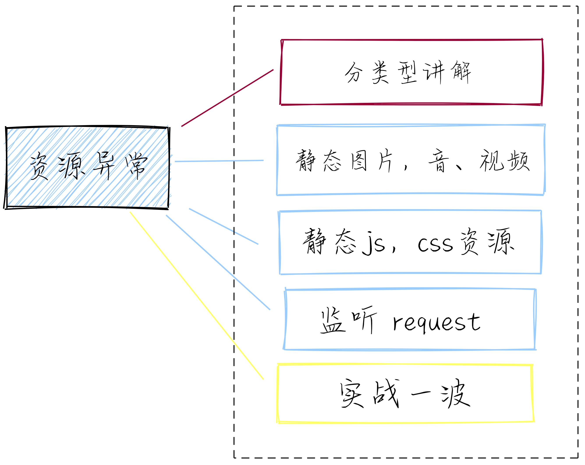
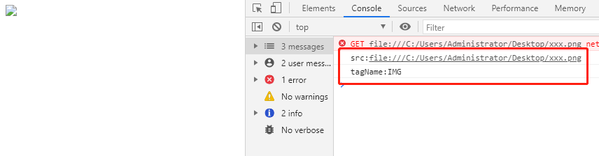

<iframe frameborder="no" border="0" marginwidth="0" marginheight="0" width=100% height=100 src="//music.163.com/outchain/player?type=2&id=1401671455&auto=0&height=66"></iframe>

## 回顾

我们在上一篇中讲到如何对于前端资源加载时间进行监控，主要的中以 `Performance` 为主。

## 前言
> 什么是资源异常？简单点说就是对 图片，视频，音频，css，js，request 请求资源时出现异常，哪些异常呢？网络错误，资源不存在等。那我需要对错误资源进行监听定位，进行错误及时上报。



## 分类型
1. 静态图片，音、视频
2. 静态js，css资源
3. 请求异常或超时

老严这篇文章准备将这些资源分为以上三个类型逐个进行讲解

## 静态图片，音、视频
### element.onerror
**注意：** `element.onerror` 与 `window.onerror` 是不同的,留个伏笔，后面老严会提上一嘴,也可以提前去[MDN [0]](https://developer.mozilla.org/zh-CN/docs/Web/API/GlobalEventHandlers/onerror)
```html
<!-- 先来个正常 -->

<script>
    document.getElementsByTagName('img')[0].onerror = function(event){
        console.log(event)
        console.log("发生时间",new Date().getTime())
    }
</script>
```
效果
.jpg)
控制台当然是干干净净咯！资源一切正常

**咱们换个错误的图片**
```html
<!-- 来个不存在的图片资源 -->

<script>
    document.getElementsByTagName('img')[0].onerror = function(event){
        console.log(event)
        console.log("发生时间",new Date().getTime())
    }
</script>
```
效果
.jpg)
我们现在已经看到了 `event` 的打印,里面有哪些东西是可用的呢？

```html

<script>
    document.getElementsByTagName('img')[0].onerror = function(event){
        console.log("发生时间",new Date().getTime())
        // 错误资源地址
        console.log('src:' + event.srcElement.src)
        // 标签
        console.log('tagName:' + event.srcElement.tagName)
        // 在这里我们就可以进行错误上报，紧急告知
    }
</script>
```
效果：


图片示例我们就已经可以看到了，当然这只是简单的一个例子，就这几行代码即可完成。
我们的页面肯定不止有图片资源，音频视频也是一样的操作，我们可以进行简单的封装一下

```html

<video src="xxx.mp4"></video>
<audio src="xxx.mp3"></audio>
<script>
    let elementArray = []
    function returnElement(el){
        let gather = []
        for(let i = 0; i < el.length; i++){
            gather.push(...document.querySelectorAll(el[i]))
        }
        return gather
    }
    elementArray = returnElement(['img', 'video', 'audio'])
    elementArray.forEach(item=>{
        item.onerror = function(event){
            console.log("发生时间",new Date().getTime())
            console.table({tagName: event.srcElement.tagName , src: event.srcElement.src})
        }
    })
</script>
```
效果：
.jpg)
你以为这就完了？
### window.addEventListener('error')
也可以使用 `window.addEventListener('error')`
```html

<script>
    window.addEventListener(
        "error",
        e => {
            e.stopImmediatePropagation();
            if (e.srcElement === window) {
                // 全局错误
                console.log("全局错误");
                console.log("message", e.message);
            } else {
                // 元素错误，比如引用资源报错
                console.log("元素错误");
                console.log("tagname", e.srcElement.tagName);
                console.log("src", e.srcElement.src);
            }
            console.log("发生时间",new Date().getTime())
            console.log("onerror捕获网络请求错误", e); // 捕获错误
        },
        true 
    );
</script>
```
效果：
.jpg)
音视频同理

## 静态js，css资源
一样的可以采用 `window.addEventListener('error')`,不过需要放到js资源之上
```html
<script>
  window.addEventListener(
      "error",
      e => {
          e.stopImmediatePropagation();
          if (e.srcElement === window) {
              // 全局错误
              console.log("全局错误");
              console.log("message", e.message);
          } else {
              // 元素错误，比如引用资源报错
              console.log("元素错误");
              console.log("tagname", e.srcElement.tagName);
              console.log("src", e.srcElement.src);
          }
          console.log("发生时间",new Date().getTime())
          console.log("onerror捕获网络请求错误", e); // 捕获错误
      },
      true 
  );
</script>
<script src="//baidu.com/test.js"></script>
```
.jpg)

**监听 css 资源**
```diff
+   console.log("src", e.srcElement.href || e.srcElement.src);
-   console.log("src", e.srcElement.src);
```
将上面的 `console.log("src", e.srcElement.src);` 修改一下即可
效果
.jpg)

## 监听 request
### window.addEventListener('unhandledrejection')

**Promise**
```js
window.addEventListener('unhandledrejection', event =>{
    // event 
    console.log(event); 
    // 异常 promise
    console.log(event.promise); 
    // 错误信息
    console.log(event.reason); 
});

function test(){
   Promise.reject('Hello, Fun debug!');
}

test();
```
.jpg)

**fetch**
```js
window.addEventListener("unhandledrejection", function (e) {
    console.log('unhandledrejection')
    console.log(e)
}, true);
// 请求返回错误
fetch('http://example.com/movies.json')
    .then(function (res) {
        return res.json();
    })
    .then(function (data) {
        console.log(data);
    });
// 无效请求
fetch('http://example.com/404.json')
    .then(function (res) {
        return res.json();
    })
    .then(function (data) {
        console.log(data);
    });
```
.jpg)

### 兼容性
unhandledrejection 的兼容性
.jpg)

下集我们会讲到捕捉异常
## 注解地址
[0] https://developer.mozilla.org/zh-CN/docs/Web/API/GlobalEventHandlers/onerror